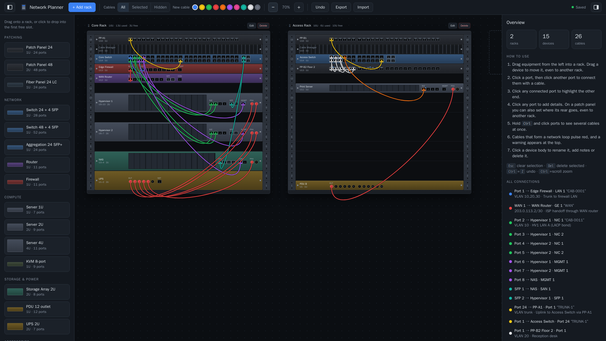
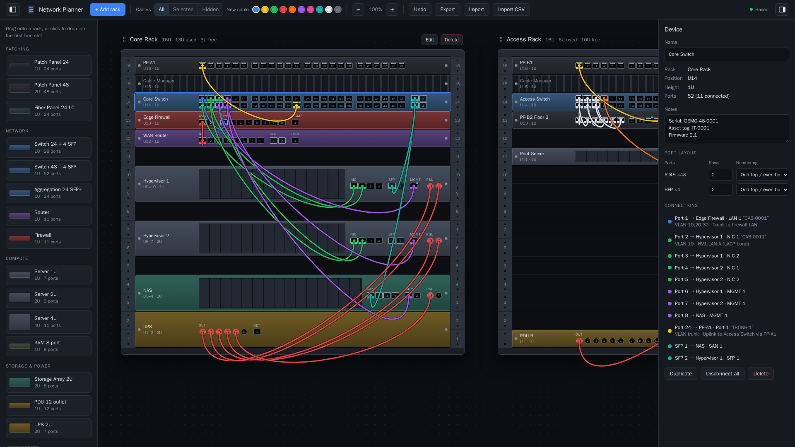
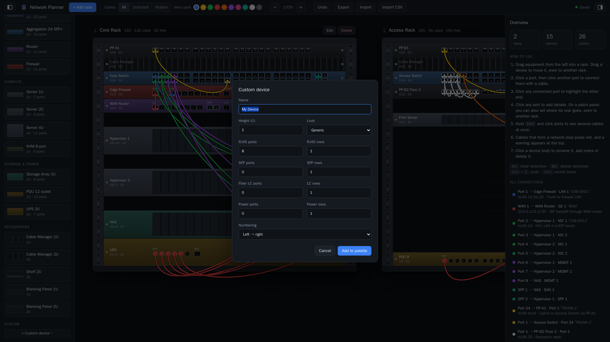
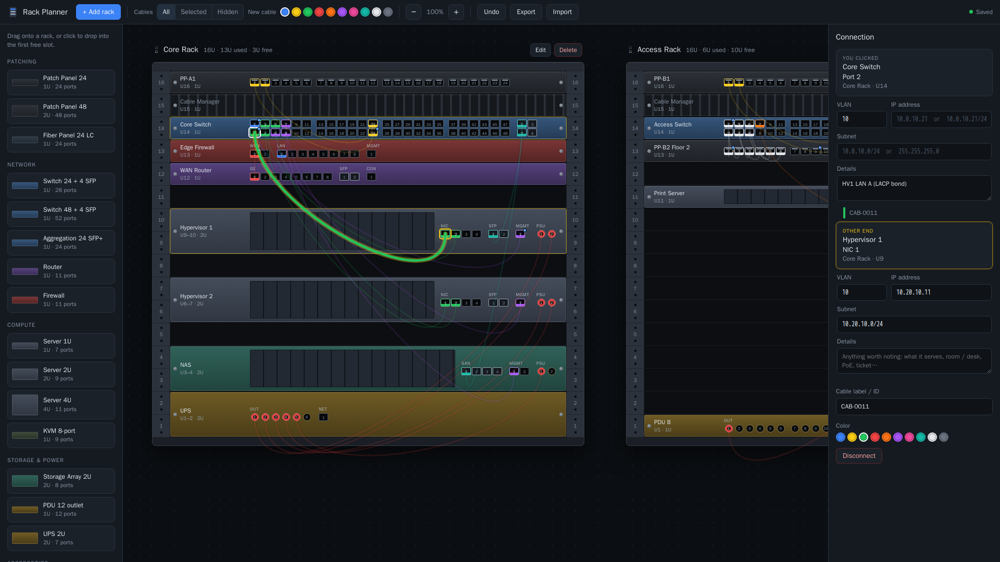
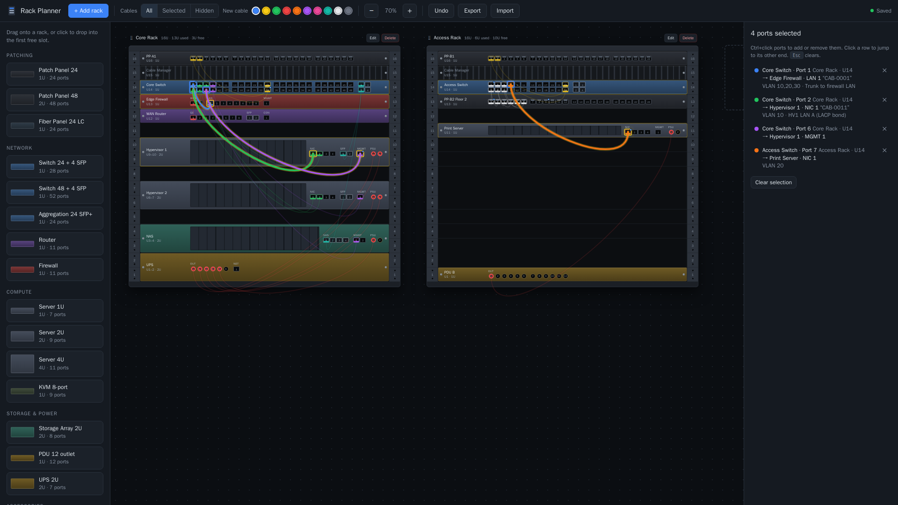
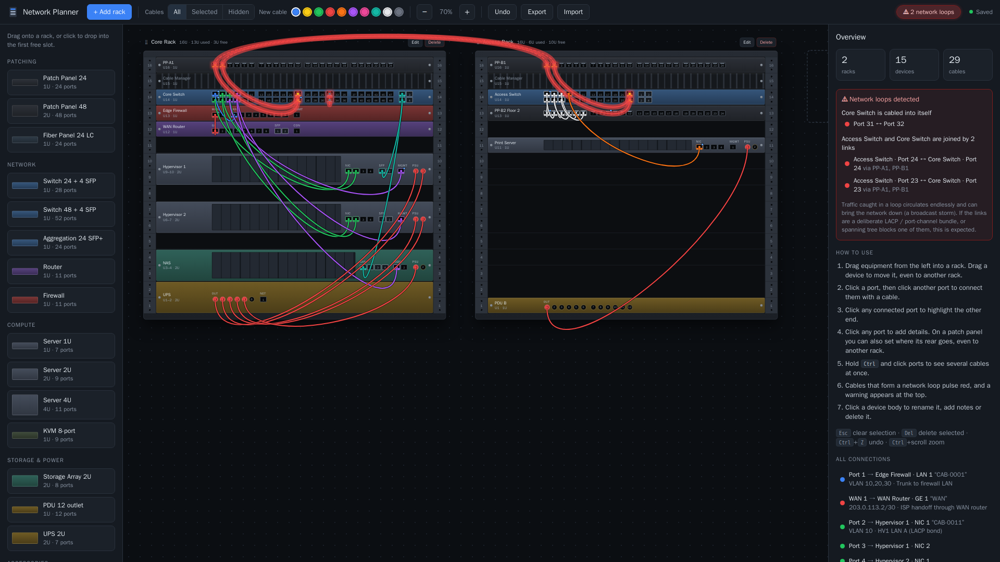
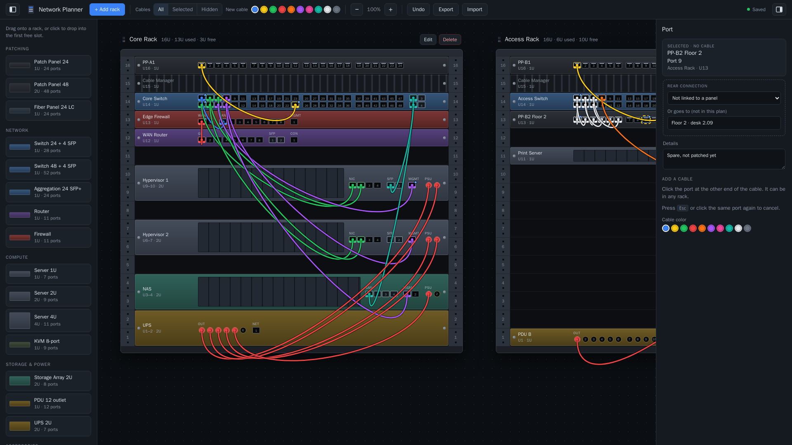
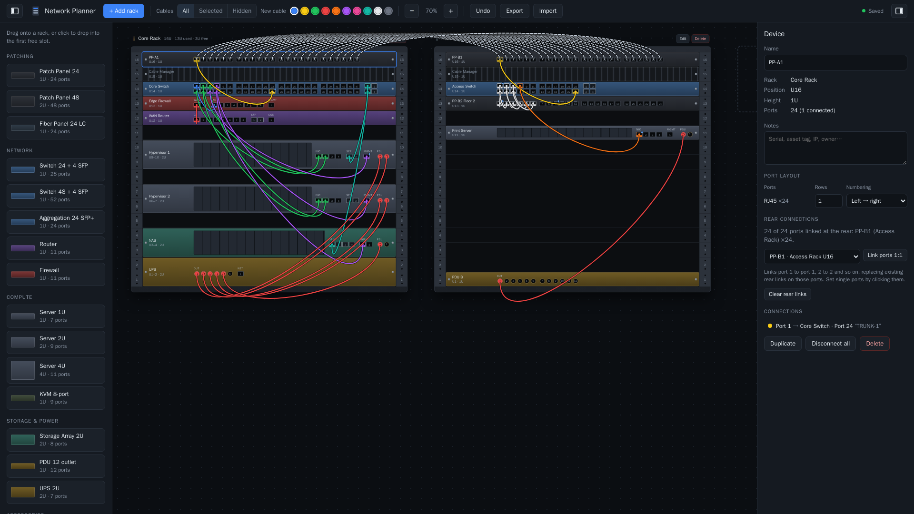
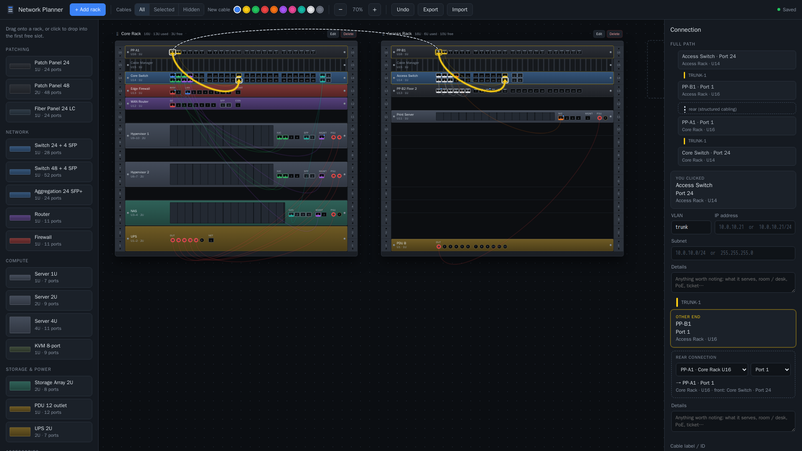

# Network Planner

A self-hosted web app for drawing server racks and documenting every cable. You build racks of any height, drag switches, patch panels, servers and other gear into them, and click two ports to connect them. After that, clicking either end of a cable highlights the other end.

It runs in a single small container, saves automatically, and needs no database.



> All screenshots in this README use a made-up demo layout. The names, VLANs and IP addresses are examples only.

## What it can do

- **Racks:** build as many racks as you need, 1–100U each, and drag them into any order.
- **Equipment:** drag switches, patch and fibre panels, routers, firewalls, servers, storage, PDUs, UPSs and accessories into racks, or define your own custom devices.
- **Cables:** click two ports to connect them, in the same rack or across racks. Give each cable a colour and a label or ID.
- **Tracing:** click either end of a cable to highlight it and make the other end pulse. Hold `Ctrl` and click ports to see several cables at once.
- **Loop detection:** a switch cabled into itself, or two switches joined by more than one link, glows red with a warning. This includes loops through patch panels.
- **Network settings:** record a VLAN, IP address and subnet on every port of an active device.
- **Port details:** write free-text notes on any port.
- **Patch panel rear connections:** record where the permanent cabling behind a panel goes, to another panel in any rack or to a wall jack or room. The app then shows the **full path** of a cable through the panels.
- **Documentation output:** download a CSV cable schedule, or export and import the whole layout as JSON.
- **Everyday use:** undo, zoom and keyboard shortcuts, with autosave to the server.

```
docker pull ghcr.io/fatalx26/networkplanner
```

Supported platforms: `linux/amd64` (Intel/AMD PCs and servers) and `linux/arm64` (Raspberry Pi 4/5, Apple Silicon, ARM NAS).

---

## Quick start

```bash
docker run -d \
  --name networkplanner \
  -p 8080:8080 \
  -v networkplanner-data:/data \
  --restart unless-stopped \
  ghcr.io/fatalx26/networkplanner:latest
```

Then open **http://localhost:8080**, or `http://<server-ip>:8080` from another machine.

- `-p 8080:8080` publishes the app. To use a different host port, change the left number, e.g. `-p 9000:8080`.
- `-v networkplanner-data:/data` keeps your layout in a named volume, so it survives restarts, upgrades and container re-creation. **Don't leave this out**, or your work is lost when the container is removed.

### Docker Compose

```yaml
services:
  networkplanner:
    image: ghcr.io/fatalx26/networkplanner:latest
    container_name: networkplanner
    ports:
      - "8080:8080"
    volumes:
      - networkplanner-data:/data
    restart: unless-stopped

volumes:
  networkplanner-data:
```

```bash
docker compose up -d
```

### Upgrading

```bash
docker pull ghcr.io/fatalx26/networkplanner:latest
docker rm -f networkplanner
# re-run the same `docker run` command as above; your layout is kept in the volume
```

With Compose: `docker compose pull && docker compose up -d`.

---

## Configuration

| Setting | Default | Purpose |
|---|---|---|
| `PORT` (env) | `8080` | Port the server listens on inside the container. |
| `DATA_DIR` (env) | `/data` | Folder where `layout.json` is stored. |
| `/data` (volume) | — | Persist this. It holds everything you've drawn. |
| `8080/tcp` (port) | — | Web UI and API. |

The container runs as the unprivileged `node` user and includes a `HEALTHCHECK` against `/healthz`.

> **Security:** the app has **no login**. Anyone who can reach the port can view and edit the layout. Keep it on a trusted network, or put it behind a reverse proxy that handles authentication (Traefik, Nginx Proxy Manager, Caddy, Authelia and so on). It works under a sub-path such as `/planner/` because it only uses relative URLs.

---

## Using the app

The screen has three columns: the **equipment palette** (left), the **racks** (centre) and the **inspector** (right).

### Racks
- **+ Add rack** creates a rack of any height from 1 to 100U. Racks sit side by side, and cables can run between them.
- **Drag a rack by its header** (the ⠿ handle and name) to reorder the racks. A blue bar shows where it will land. Its devices and cables move with it, and `Ctrl+Z` undoes the move.
- A rack's **Edit** button renames or resizes it. You can't shrink it below installed equipment. **Delete** removes the rack along with its devices and their cables.
- U numbers on the rails count from U1 at the bottom, like a real rack.

### Equipment
- **Drag** an item from the palette onto a rack. A **green** outline means it fits and **red** means it overlaps something or sticks out of the rack.
- **Click** a palette item to drop it into the first free slot.
- **Drag a placed device** to move it within a rack or to another rack. Its cables stay connected.
- **Click a device body** to open it in the inspector. From there you can rename it, add notes (serial, asset tag, IP), change its port layout, list its connections, duplicate it or delete it.



Built-in equipment:

| Category | Items |
|---|---|
| Patching | Patch panel 24 (1U), Patch panel 48 (2U), Fibre panel 24 LC |
| Network | Switch 24 + 4 SFP, Switch 48 + 4 SFP, Aggregation 24 SFP+, Router, Firewall |
| Compute | Server 1U / 2U / 4U (NIC, SFP, MGMT and PSU ports), KVM 8-port |
| Storage & Power | Storage array 2U, PDU 12-outlet, UPS 2U |
| Accessories | Cable manager 1U/2U, shelf 2U, blanking panels 1U/2U |

**Custom devices:** the **+ Custom device…** form sets the name, height, look, and the number of RJ45, SFP, fibre LC and power ports, plus how many **rows** each type is laid out in. Custom devices are saved into the palette as part of the layout.



**Port layout:** for any placed device, the inspector's *Port layout* section changes the number of rows and the numbering order of each port group. The options are *left to right*, or *odd on top, even below* (the usual switch style). A device can have up to 2 rows per rack unit, and existing cables stay attached.

### Cables
1. Click a free port. It blinks yellow.
2. Click the port at the other end, in any device and any rack. A cable is drawn between them in the current **New cable** colour.
3. Click **either end** of a cable at any time. The cable is highlighted, the **other end pulses** and the view scrolls to it. The inspector shows both ends ("You clicked" / "Other end"), and you can give the cable a label or ID, recolour it or disconnect it.
4. Hover a connected port to outline its far end without clicking.



#### Seeing several cables at once
Hold `Ctrl` (`Cmd` on a Mac) and click ports.
- Each selected port gets a blue ring and the far end of its cable pulses. Routes through patch panel rear links are highlighted all the way to the end. All other cables dim.
- The right-hand panel lists each selected port, where its cable goes, where it finally ends if it passes through panels, and any VLAN, IP or details. Click a row to jump to its other end, or its **×** to remove it.
- `Ctrl`+click a selected port again to remove it. A normal click, `Esc` or **Clear selection** ends the multi-selection.
- If a port is already selected with a normal click, `Ctrl`+clicking another port adds both.



#### Network loop warnings
The app watches for cabling that would create a switching loop:

| Loop | Example |
|---|---|
| **A switch cabled into itself** | Switch 1 port 1 ↔ Switch 1 port 2 |
| **Two or more links between the same two switches** | Switch 1 port 3 ↔ Switch 2 port 1 *and* Switch 1 port 4 ↔ Switch 2 port 2 |

- **Patch panels count:** cables are followed through patch panel rear links. A switch that goes out through a panel, across the rear cabling and back into itself, or into another switch, is detected too.
- **What you see:** every cable, port and rear link on the loop glows and slowly pulses red. A **⚠ N network loops** button appears in the toolbar. Click it to see the list.
- **Where loops are listed:** the Overview panel lists every loop, and the Connection and Device panels show the loops their cable or device is part of. Click a row to select that cable.
- **Clearing a warning:** the warning clears as soon as the cabling no longer loops, for example after you disconnect one of the links.
- **Which devices count:** only devices with the **switch** look, including custom devices built with that look.
- **Deliberate double links:** these are flagged too, such as LACP / port-channel bundles, or links where spanning tree blocks one path. The warning says so, and you can leave them as they are.



In this example, the self-loop on Core Switch (port 31 ↔ port 32) is a cabling mistake. The two trunks between Core Switch and Access Switch run through the patch panels, and would be fine if they were configured as an LACP bundle.

### Network settings (VLAN, IP, subnet)
Every port on an active device (switch, router, firewall, server and so on) has three fields. They appear under each end in the **Connection** panel, and in the **Port** panel for a port with no cable:

| Field | Examples |
|---|---|
| **VLAN** | `10`, a trunk list like `10,20,30-40`, or `trunk` |
| **IP address** | `10.0.10.21` or `10.0.10.21/24` (IPv6 is accepted too) |
| **Subnet** | `10.0.10.0/24` or `255.255.255.0` |

- **Patch panel ends** have no fields. They're passive and just pass the cable through.
- **Checking:** a value that doesn't look valid gets an orange outline, but it's still saved.
- **Stored per port:** the settings belong to the port, not the cable, so they stay if you disconnect and re-cable it.
- **Where they show up:** in the port's hover tooltip, in the device panel's connection list and in the CSV export.
- **Duplicating a device** gives the copy blank port settings, so IP addresses aren't repeated.

### Port details
Click any port, with or without a cable, to open its panel. The **Details** box takes free text, such as what the port serves, a room or desk number, PoE or a ticket number.
- Ports with details show a small blue dot in the top-right corner.
- The text appears in the port's tooltip, the device panel's connection list and the CSV export.
- Clicking a port with no cable opens the **Port** panel. You can fill in its settings there, and clicking a second port still creates a cable as usual.



### Patch panel rear connections
Patch and fibre panel ports have a **Rear connection** box, which records where the permanent cabling behind the panel goes.
- **To another panel:** pick the panel (in any rack) and the port. Choosing a panel picks the same port number automatically if it's free.
- **Somewhere outside the plan:** leave the panel as "Not linked" and type a destination, such as `Office 2.14 wall jack`.
- **Whole panel at once:** click the panel itself, choose the other panel under **Rear connections**, then click **Link ports 1:1**. Port 1 goes to port 1, port 2 to port 2 and so on.



**How rear links show up:**
- Linked ports have a grey bar along the top.
- Selecting a linked port or panel draws dashed lines to the far panel.
- When a cable's route passes through panels, the Connection panel shows a **Full path**. Everything on that route is highlighted. In the example below, the path is Access Switch → PP-B1 → *rear* → PP-A1 (Core Rack) → Core Switch.



- The CSV export has a **Rear** column for each end.
- Deleting a panel removes its rear links. Undo brings them back.

The **Cables: All / Selected / Hidden** toggle controls how many cables are drawn, which helps in busy racks.

### Other features
- **Overview panel** (click empty space): shows totals and every connection, plus **Download CSV**, a cable schedule with the rack, U, device, port, VLAN, IP, subnet, rear connection and details for each end.
- **Export / Import**: back up or restore the whole layout as a JSON file.
- **Undo**: `Ctrl+Z`, up to 150 steps.
- **Zoom**: the −/+ buttons, or `Ctrl` + mouse wheel.
- **Keyboard**: `Esc` clears the selection, and `Delete` removes the selected cable or device.
- **Autosave**: every change is saved to the server within half a second. The indicator in the top right shows *Saved*. If the server can't be reached, changes are kept in the browser and the indicator says so.

---

## Backup and restore

- **From the UI:** use **Export**, and later **Import**.
- **From the host:** the layout is a single file, `/data/layout.json`.

```bash
# back up
docker cp networkplanner:/data/layout.json ./layout-backup.json
# restore
docker cp ./layout-backup.json networkplanner:/data/layout.json && docker restart networkplanner
```

---

## HTTP API

| Method | Path | Description |
|---|---|---|
| `GET` | `/api/layout` | Returns the saved layout JSON (`204` if nothing has been saved yet). |
| `PUT` | `/api/layout` | Replaces the layout. The body must be JSON with `racks` and `devices` arrays. Max 20 MB. |
| `GET` | `/healthz` | Returns `ok`. Used by the container health check. |

### Layout format

```jsonc
{
  "version": 1,
  "racks":   [{ "id": "rack_x", "name": "Rack A", "units": 42 }],
  "devices": [{
    "id": "dev_y", "rackId": "rack_x", "name": "Switch 1",
    "u": 40,            // lowest rack unit the device occupies (U1 = bottom)
    "height": 1,        // in rack units
    "skin": "switch",   // visual style
    "notes": "",
    "groups": [         // port groups, in display order
      { "kind": "rj45", "count": 48, "rows": 2, "label": "", "numbering": "oddeven" },
      { "kind": "sfp",  "count": 4,  "rows": 2, "label": "SFP", "numbering": "oddeven" }
    ],
    "portInfo": {       // per-port settings, keyed "groupIndex:portIndex"
      "0:0": { "vlan": "10", "ip": "10.0.10.2", "subnet": "10.0.10.0/24", "details": "Uplink to core" }
    }
  }],
  "rearLinks": [        // cabling behind two patch/fiber panel ports (port keys)
    { "a": "dev_pp1:0:0", "b": "dev_pp9:0:0" }
  ],
  "connections": [{
    "id": "c_z", "color": "#3b82f6", "label": "CAB-0142",
    "a": "dev_y:0:0",   // port key = deviceId:groupIndex:portIndex (0-based)
    "b": "dev_q:0:0"
  }],
  "custom": []          // user-defined palette templates
}
```

---

## Project structure

| File | What it does |
|---|---|
| `server.js` | Node.js HTTP server that uses only built-in modules. It serves `public/`, stores the layout at `$DATA_DIR/layout.json` with atomic writes, and answers `/healthz`. |
| `public/index.html` | Page shell: top toolbar, palette, workspace, inspector and the form dialog. |
| `public/app.js` | The whole application: device catalogue, state and undo, rendering of racks, ports and SVG cables, drag and drop, the port-click connection logic, the inspector, import/export and autosave. |
| `public/styles.css` | Dark theme, rack and device visuals, port states (pending, highlighted, pulsing), cable styling. |
| `docs/screenshots/` | The README screenshots, taken from a made-up demo layout. They're left out of the Docker image. |
| `Dockerfile` | `node:22-alpine` image running as a non-root user, with a `/data` volume, health check and OCI labels. |
| `docker-compose.yml` | One-command deployment. It pulls the published image, or builds locally with `--build`. |
| `.github/workflows/docker-publish.yml` | CI that builds and publishes the image to `ghcr.io` on every push to `main` and for version tags. |

### Building it yourself

```bash
docker build -t networkplanner .
docker run -d -p 8080:8080 -v networkplanner-data:/data networkplanner
```

### How the published image is made

The workflow [`.github/workflows/docker-publish.yml`](.github/workflows/docker-publish.yml) builds the image for amd64 and arm64 and pushes it to GitHub Container Registry automatically:

| Event | Tags published |
|---|---|
| Push to `main` | `latest`, `sha-<commit>` |
| Push a tag like `v1.2.0` | `1.2.0`, `1.2`, `latest` |
| Pull request | built only, nothing published |

To release a version:

```bash
git tag v1.1.0
git push origin v1.1.0
```

To run without Docker (Node 18 or newer): `node server.js`, then open http://localhost:8080.

---

## License

[MIT](LICENSE). You're free to use, modify and redistribute this, including commercially, as long as the copyright notice is kept.
